# School District Analysis

## Overview
This analysis aims to evaluate a school district data to identify if budget, size, and school types affect the students performance. The dataset contains information of 9th to 12th grade students in reading and math. In the data cleansing step, it was necessary remove data from 9th graders from one of the schools in the district, Thomas High School, due to evidences of academic dishonesty. Thus, results will compare the dataframes before and after the data cleansing step. This analysis was made using python library pandas and jupyter notebook. The complete analysis can be found on [PyCitySchools_Challenge.ipynb](PyCitySchools_Challenge.ipynb).

## Results

- Below is the District Summary before and after cleaning data from 9th graders from Thomas high school, is it possible to notice a small diference in  the average  math score, as well as math, reading and overall passing percentages.

**Before:**
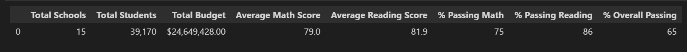

**After:**
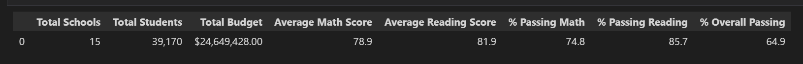

- The school summary has changed only in the Thomas High School row, highlighted in the images below. Values for average math and reading scores, reading, math, and overall percentages changed slightly after removing the 9th graders'data.

**Before:**
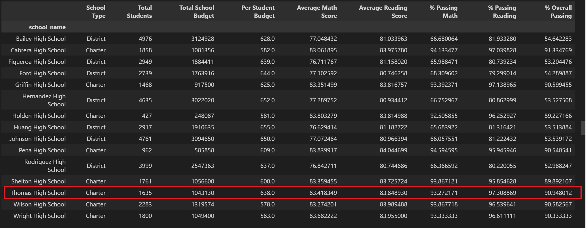

**After:**
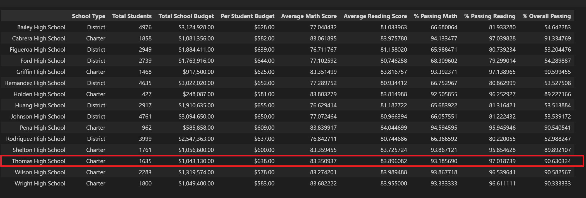

- Removing the data from the 9th graders did not affect the performance of Thomas High School when compared to the other schools in the district. Because the difference was so small, Thomas High School continues as a second top school in the district after the cleaning step.
   
- In the data frames Math and reading scores by grade, the averaves for the 9th graders from Thomas High School are filled with a 'nan', because the values were replaced using the method numpy.nan. The other values remain intact.
    
    **Math:**
    
    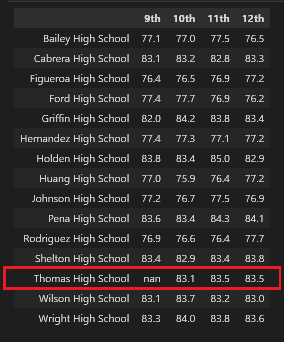
    
    **Reading:**  
    
    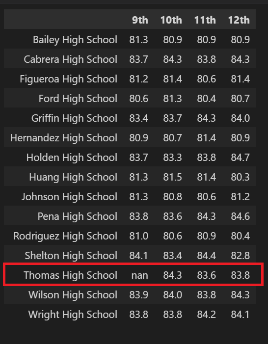

- The other data frames do not present any change. Even though they are using updated values after cleaning data, the difference is not significant enough to change the output. Below are the screenshots before and after cleaning for comparison.

    - Scores by school spending
    
    **Before:**
    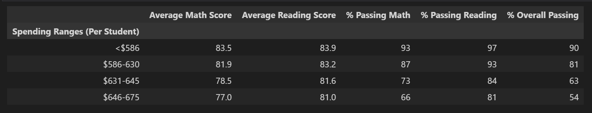

    **After:**    
    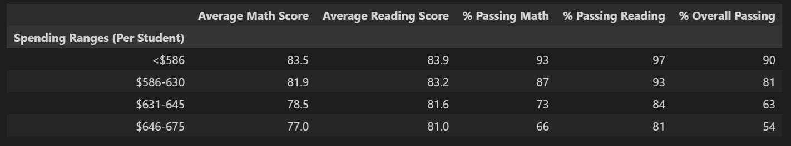
    
    - Scores by school size

    **Before:**
    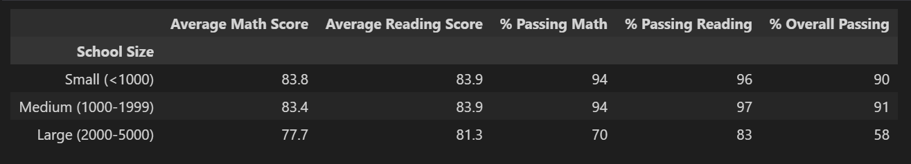

    **After:**   
    
    
    - Scores by school type
   
    **Before:**
    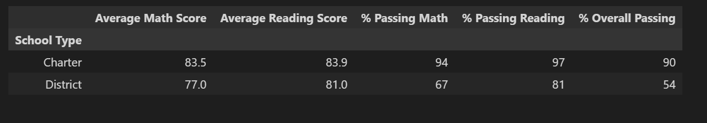
 
    **After:**   
    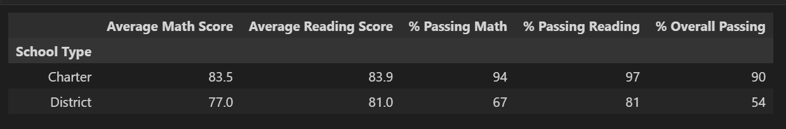

## Summary
Some crucial changes made in the code to meet the new requirements are:

- Scores from 9th grade students from Thomas high School were replaced by "NaN" using numpy.nan, which means that they were not considered when calculating averages.

- A new 'count' was included to identify the students that wouldn't be considered in the analysis. As a result, 461 students were removed, and 38709 was the total of students used to calculate passing percentages. 

- The method 'loc' was used to filter data from 10th - 12th grade students from Thomas High School in order to calculate new averages scores for math and reading, as well passing percentages for both subjects and overall. 

- Finally, the new values for Thomas High School replaced the old ones on the School Summary data frame, affecting all data frames that used data from per_school_summary_df, even though the end values remained the same in the School type, school size, and spending data frames.
